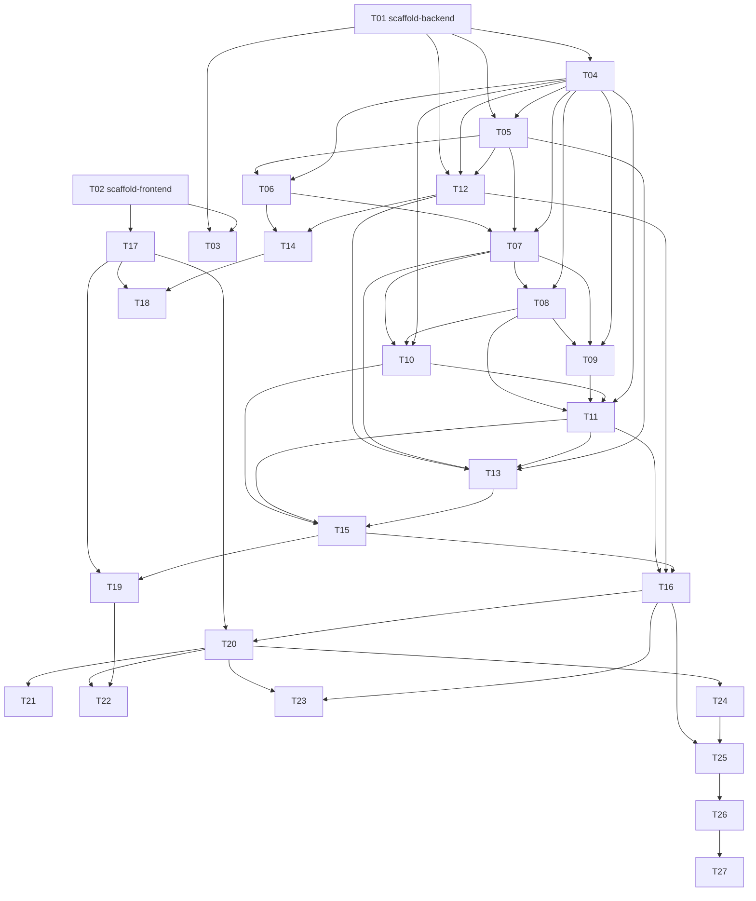

# План реализации

## Контекст
Go Dependencies Visualizer — веб-инструмент статического анализа Go-проектов и интерактивной визуализации графа зависимостей с подсветкой мёртвого кода. Один Docker-образ, Go backend + React/Cytoscape SPA в `embed.FS`. Архитектурный вариант C: SSE streaming + disk-cached artifacts (`docs/architecture.md`). Курсовой проект ВШЭ БПИ236, защита 26.04–15.05.2026.

## Стек
Go 1.26 (stdlib `net/http.ServeMux` method-routing + `x/tools/go/packages` v0.44+); React 19.2 + TypeScript 6 + Vite 8 + Cytoscape.js 3.33 (+ `cytoscape-svg`); Node 24 LTS (build); Docker multi-stage multi-arch (distroless); GitHub Actions CI. Все версии сверены с go.dev / react.dev / vitejs.dev / typescriptlang.org / js.cytoscape.org / nodejs.org на 2026-04-19.

## Сводная таблица

| ID | Название | Зависит от | Size | Component | Status |
|----|----------|-----------|------|-----------|--------|
| T01 | Scaffold backend | — | S | infra | [x] |
| T02 | Scaffold frontend | — | S | infra | [x] |
| T03 | CI GitHub Actions | T01, T02 | S | infra | [x] |
| T04 | Доменные типы | T01 | M | backend/domain | [x] |
| T05 | DiskCacheManager | T01, T04 | M | backend/cache | [x] |
| T06 | ProjectLoader (ZIP) | T01, T04, T05 | M | backend/loader | [x] |
| T07 | Parser + parsed.gob | T01, T04, T05, T06 | L | backend/parser | [x] |
| T08 | GraphBuilder | T04, T07 | L | backend/graph | [x] |
| T09 | InterfaceResolver | T04, T07, T08 | M | backend/graph | [x] |
| T10 | EntryPointsResolver | T04, T07, T08 | M | backend/entry | [x] |
| T11 | ReachabilityAnalyzer | T04, T08, T09, T10 | M | backend/reach | [x] |
| T12 | HTTP скелет + middleware | T01, T04, T05 | M | backend/api | [x] |
| T13 | AnalysisOrchestrator + SSE | T04, T05, T07, T11, T12 | M | backend/api | [x] |
| T14 | POST /api/projects | T06, T12 | S | backend/api | [x] |
| T15 | POST /analyze (SSE) | T10, T11, T13 | L | backend/api | [x] |
| T16 | GET /graph + /dead-code | T11, T12, T15 | M | backend/api | [x] |
| T17 | Frontend app shell | T02 | M | frontend/core | [x] |
| T18 | Landing + upload | T14, T17 | M | frontend/upload | [x] |
| T19 | Analyzing view (SSE) | T15, T17 | M | frontend/sse | [x] |
| T20 | Cytoscape integration | T16, T17 | L | frontend/graph | [x] |
| T21 | Filters panel | T20 | S | frontend/graph | [x] |
| T22 | Entry-points + Info panels | T19, T20 | M | frontend/graph | [ ] |
| T23 | Dead-code panel + modes | T16, T20 | M | frontend/graph | [ ] |
| T24 | PNG/SVG export + aggregation | T20 | M | frontend/graph | [ ] |
| T25 | Dockerfile multi-arch | T16, T24 | S | infra | [ ] |
| T26 | E2E Playwright suite | T25 | L | test | [ ] |
| T27 | Demo projects + walkthrough | T26 | S | demo | [ ] |

Size: S ≈ полдня, M ≈ день, L ≈ 2–3 дня.

## Граф зависимостей

## Рекомендованный порядок исполнения

Топологический порядок с тремя параллельными треками после T01+T02:

**Трек A (backend core):** T01 → T04 → T05 → T06 → T07 → T08 → T09 → T10 → T11
**Трек B (backend API):** T12 → T13 → T14 → T15 → T16 (после того, как T05 + T11 готовы)
**Трек C (frontend):** T02 → T17 → T20 → (T21 ∥ T22 ∥ T23 ∥ T24)
**CI (параллельно):** T03 стартует после T01 + T02

Критические синхронизации:
- T12 должен быть готов до T13/T14/T15/T16.
- T14 и T15 готовы до T18 и T19 соответственно.
- T16 готов до T20, T23 (graph endpoint и dead-code).
- T20 готов до всех остальных frontend-panel задач (T21–T24).

**Финал:** T25 → T26 → T27.

Критический путь ≈ T01 → T04 → T05 → T06 → T07 → T08 → T09 → T10 → T11 → T13 → T15 → T16 → T20 → T24 → T25 → T26 → T27 (17 задач). T09 и T10 идут параллельно после T08 — последний из них завершает путь к T11.

## Как запускать задачу
1. Открой `tasks/T##-<slug>.md`.
2. Запусти новую сессию Claude Code в корне репо командой `claude`.
3. Первым сообщением подай промпт из `prompts/04_EXECUTE_TASK.md` + в конец строку: `ЗАДАЧА: T##-<slug>`.
4. Агент прочитает `tasks/T##-<slug>.md` + указанные `docs/*`, создаст ветку, реализует, протестирует, запушит.
5. После merge — переход к следующей задаче из топологического порядка.

## Статус
- [x] T01 Scaffold backend
- [x] T02 Scaffold frontend
- [x] T03 CI GitHub Actions
- [x] T04 Доменные типы
- [x] T05 DiskCacheManager
- [x] T06 ProjectLoader (ZIP)
- [x] T07 Parser + parsed.gob
- [x] T08 GraphBuilder
- [x] T09 InterfaceResolver
- [x] T10 EntryPointsResolver
- [x] T11 ReachabilityAnalyzer
- [x] T12 HTTP скелет + middleware
- [x] T13 AnalysisOrchestrator + SSE
- [x] T14 POST /api/projects
- [x] T15 POST /analyze (SSE)
- [x] T16 GET /graph + /dead-code
- [x] T17 Frontend app shell
- [x] T18 Landing + upload
- [x] T19 Analyzing view (SSE)
- [ ] T20 Cytoscape integration
- [x] T21 Filters panel
- [ ] T22 Entry-points + Info panels
- [ ] T23 Dead-code panel + modes
- [ ] T24 PNG/SVG export + aggregation
- [ ] T25 Dockerfile multi-arch
- [ ] T26 E2E Playwright suite
- [ ] T27 Demo projects + walkthrough
